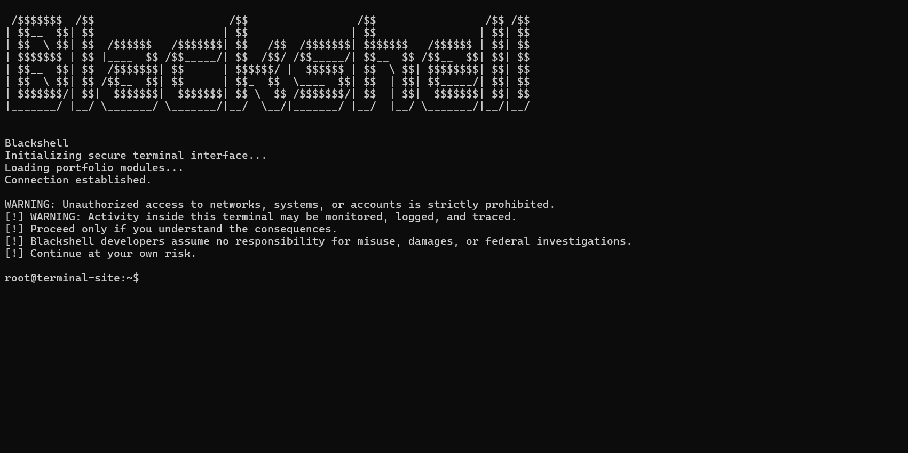

<div align="center">

# Blackshell

**Powerful & Private Hacking Tool**

[](https://www.python.org/)
[](https://www.python.org/)
[](#)

Created by **Acap**

`Discord: acap.official`

[Portfolio](https://acap-portfolio.edgeone.app/)
[Discord](https://discord.gg/fKSSYRfxyN)
[Linkpad](https://linkpad.lol/acap)
[Youtube](https://www.youtube.com/@acapishere)

</div>

---

## Download
- You can download the tool on [mediafire](https://www.mediafire.com/file/80ukf0p8qjfb7tx/Blackshell.exe/file)



---

## Commands
Here are all the available commands of our tool

### Spoof (Steal Information)

```
spoof [email]
```
> Example: `spoof thisisanemail@gmail.com`

### Find (Global Searching)

```
`find [name]`
```
> Example: `find MrRobot`

### Scan (Scan Email)
If you wanna be some vigilante/hero, this command will scan for all sorts of illegal stuff that are related to the email that has been spoofed.

```
scan
```
> Example: `scan`

If you haven't spoofed an email yet, then the command will not work.

### Trace (IP Address)

```
`trace [ip]`
```
> Example: `trace 123.4567.8910`

### Scan (Scan Website)

```
`scan [website]`
```
> Example: `scan https://github.com`

### Decrypt (Hash)

```
`decrypt [hash]`
```

### Breach (Server)

```
`breach [server]`
```

### WhoIs (Identifier)

```
`whois [target]`
```
---

## Information

> **Please use this tool properly.**

> Using this tool itself may be illegal and runs the risk of being monitored, logged or traced.
